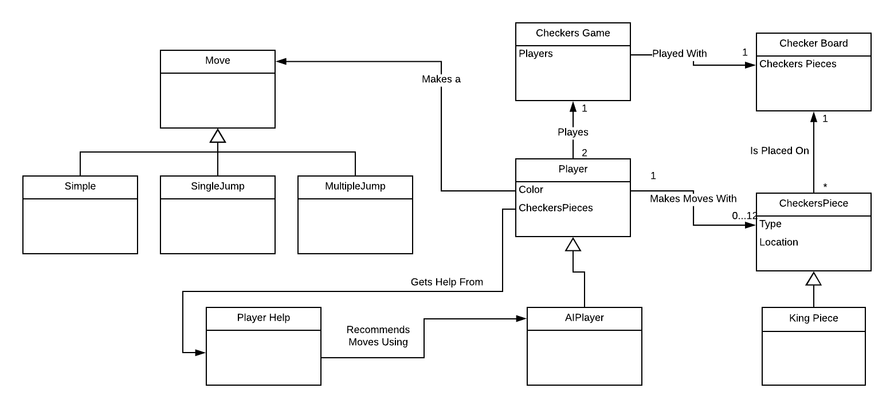

# PROJECT Design Documentation

## Team Information
* Team name: null
* Team members
  * Sean Coyne
  * Jeffery Russell
  * Bryce Murphy
  * Max Gusinov
  * Perry Deng

## Executive Summary

From the SE vision document [here](http://www.se.rit.edu/~swen-261/projects/WebCheckers/Vision_document.html):
"The application must allow players to play checkers with other players who are currently signed-in. The game user interface (UI) will support a game experience using drag-and-drop browser capabilities for making moves. Beyond this minimal set of features, we have grand vision for how we could further enhance the player experience with some additional features beyond the basic checkers game".

### Purpose

To create a fully functional version of online checkers using Java
and the Spark framework for all checkers enthusiasts looking to
play a digitized form of the game.

### Glossary and Acronyms

| Term | Definition |
|------|------------|
| VO | Value Object |
| AI | Artificial Intelligence |
| HTML | Hyper-Text Markup Language |
| CSS | Cascading Style Sheets |

## Requirements

This section describes the features of the application.

### Definition of MVP
Players must be able to play of checkers on a website adhering to the American Rules. Before
playing a game players must be able to sign in. Players must also be able to sign out. Two
players must be able to play a game of checkers with another player following the american 
rules. At any point in the game a player must be able to resign which ends the game. 

### MVP Features
- Players must be able to sign in.
- Players must be able to sign out
- Two playes must be able to play a game of checkers adnering to the [American rules](http://www.se.rit.edu/~swen-261/projects/WebCheckers/American%20Rules.html).
- At any point in the game a player must be able to resign from the game at which point the other player Wins by default. 

### Roadmap of Enhancements
- AI Player: The player will have the option to play a game against a artificial intelligence.
- Player Help: If chosen, the player will be able to get move reccomendations from the server. This will then display on the board. 

## Application Domain

This section describes the application domain.

In this domain model, we captured the high level aspects of playing a game of
checkers. Each checkers game consists of two players, a red player and a black
player. The game is played on a 8x8 checkers board with each player starting
with 12 pieces and losing pieces throughout the game. With a checkers piece,
each player can make a move. This move can either be a simple move, a jump move, or a 
multi-jump move. Not all players are humans. Some players can be AI players. 

## Architecture and Design

This section describes the application architecture.

### Summary

The following Tiers/Layers model shows a high-level view of the webapp's architecture.

As a web application, the user interacts with the system using a
browser.  The client-side of the UI is composed of HTML pages with
some minimal CSS for styling the page.  There is also some JavaScript
that has been provided to the team by the architect.

The server-side tiers include the UI Tier that is composed of UI Controllers and Views.
Controllers are built using the Spark framework and View are built using the FreeMarker framework.  The Application and Model tiers are built using plain-old Java objects (POJOs).

Details of the components within these tiers are supplied below.

### Overview of User Interface

This section describes the web interface flow; this is how the user views and interacts
with the WebCheckers application.

When the user initially goes to the website, they land on a home page. From there,
the user can go to the sign-in page. After a user has selected a valid username,
they can go back to the home page where they are now able to see the player lobby. After 
being selected or selecting a player to play a game with, the user is sent to 
the game page where they can play a game of checkers. 

### UI Tier
> _Provide a summary of the Server-side UI tier of your architecture.
> Describe the types of components in the tier and describe their
> responsibilities.  This should be a narrative description, i.e. it has
> a flow or "story line" that the reader can follow._

> _At appropriate places as part of this narrative provide one or more
> static models (UML class structure or object diagrams) with some
> details such as critical attributes and methods._

> _You must also provide any dynamic models, such as statechart and
> sequence diagrams, as is relevant to a particular aspect of the design
> that you are describing.  For example, in WebCheckers you might create
> a sequence diagram of the `POST /validateMove` HTTP request processing
> or you might show a statechart diagram if the Game component uses a
> state machine to manage the game._

> _If a dynamic model, such as a statechart describes a feature that is
> not mostly in this tier and cuts across multiple tiers, you can
> consider placing the narrative description of that feature in a
> separate section for describing significant features. Place this after
> you describe the design of the three tiers._

### Application Tier
> _Provide a summary of the Application tier of your architecture. This
> section will follow the same instructions that are given for the UI
> Tier above._

### Model Tier
> _Provide a summary of the Application tier of your architecture. This
> section will follow the same instructions that are given for the UI
> Tier above._

### Design Improvements
> _Discuss design improvements that you would make if the project were
> to continue. These improvement should be based on your direct
> analysis of where there are problems in the code base which could be
> addressed with design changes, and describe those suggested design
> improvements. After completion of the Code metrics exercise, you
> will also discuss the resutling metric measurements.  Indicate the
> hot spots the metrics identified in your code base, and your
> suggested design improvements to address those hot spots._

## Testing
> _This section will provide information about the testing performed
> and the results of the testing._

### Acceptance Testing
> _Report on the number of user stories that have passed all their
> acceptance criteria tests, the number that have some acceptance
> criteria tests failing, and the number of user stories that
> have not had any testing yet. Highlight the issues found during
> acceptance testing and if there are any concerns._

### Unit Testing and Code Coverage
> _Discuss your unit testing strategy. Report on the code coverage
> achieved from unit testing of the code base. Discuss the team's
> coverage targets, why you selected those values, and how well your
> code coverage met your targets. If there are any anomalies, discuss
> those._
