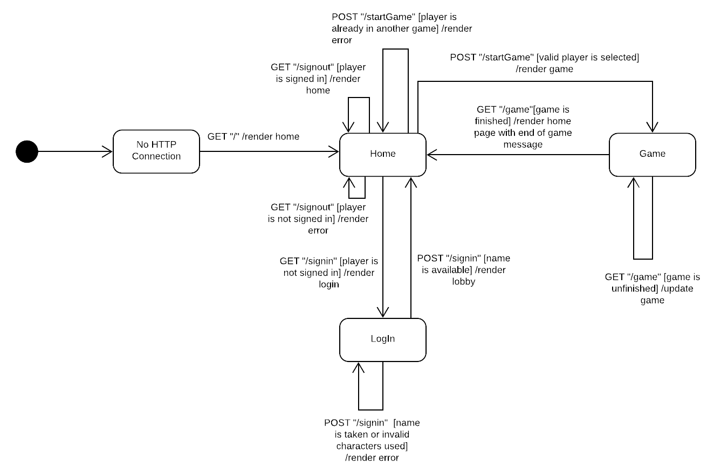

# PROJECT Design Documentation

## Team Information
* Team name: null
* Team members
  * Sean Coyne
  * Jeffery Russell
  * Bryce Murphy
  * Max Gusinov
  * Perry Deng

## Executive Summary

From the SE vision document [here](http://www.se.rit.edu/~swen-261/projects/WebCheckers/Vision_document.html):
"The application must allow players to play checkers with other players who are currently signed-in. The game user interface (UI) will support a game experience using drag-and-drop browser capabilities for making moves. Beyond this minimal set of features, we have grand vision for how we could further enhance the player experience with some additional features beyond the basic checkers game".

### Purpose

To create a fully functional version of online checkers using Java
and the Spark framework for all checkers enthusiasts looking to
play a digitized form of the game.

### Glossary and Acronyms

| Term | Definition |
|------|------------|
| VO | Value Object |
| AI | Artificial Intelligence |
| HTML | Hyper-Text Markup Language |
| CSS | Cascading Style Sheets |


## Requirements

This section describes the features of the application.

### Definition of MVP
Players must be able to play of checkers on a website adhering to the American Rules. Before
playing a game players must be able to sign in. Players must also be able to sign out. Two
players must be able to play a game of checkers with another player following the american 
rules. At any point in the game a player must be able to resign which ends the game. 

### MVP Features
- Players must be able to sign in.
- Players must be able to sign out
- Two playes must be able to play a game of checkers adnering to the [American rules](http://www.se.rit.edu/~swen-261/projects/WebCheckers/American%20Rules.html).
- At any point in the game a player must be able to resign from the game at which point the other player Wins by default. 

### Roadmap of Enhancements
- AI Player: The player will have the option to play a game against a artificial intelligence.
- Player Help: If chosen, the player will be able to get move reccomendations from the server. This will then display on the board. 


## Application Domain

This section describes the application domain.


In this domain model, we captured the high level aspects of playing a game of
checkers. Each checkers game consists of two players, a red player and a black
player. The game is played on a 8x8 checkers board with each player starting
with 12 pieces and losing pieces throughout the game. With a checkers piece,
each player can make a move. This move can either be a simple move, a jump move, or a 
multi-jump move. Not all players are humans. Some players can be AI players. 


## Architecture and Design

This section describes the application architecture.

### Summary

The following Tiers/Layers model shows a high-level view of the webapp's architecture.


As a web application, the user interacts with the system using a
browser.  The client-side of the UI is composed of HTML pages with
some minimal CSS for styling the page.  There is also some JavaScript
that has been provided to the team by the architect.

The server-side tiers include the UI Tier that is composed of UI Controllers and Views.
Controllers are built using the Spark framework and View are built using the FreeMarker framework.  The Application and Model tiers are built using plain-old Java objects (POJOs).

Details of the components within these tiers are supplied below.


### Overview of User Interface

This section describes the web interface flow; this is how the user views and interacts
with the WebCheckers application.



When the user initially goes to the website, they land on a home page. From there,
the user can go to the sign-in page. After a user has selected a valid username,
they can go back to the home page where they are now able to see the player lobby. After 
being selected or selecting a player to play a game with, the user is sent to 
the game page where they can play a game of checkers. 


### UI Tier

####High Level Overview of UI Tier Routes:

Web Server Routes:
- Web Server:
 Initializes and sets up all the handlers. 
- Get Home:
Returns and renders the home page.
- Get Game:
Renders the game which the player is currently in.
- Post Start Game:
Attempts to put the user in a game with another player. 
- Post Sign In:
Sign-in to the web server with a requested username.
- Get Sign in:
Renders the sign-in page. 


UI Tier Ajax Handlers:
- Post Check Turn:
Determines if it is the current players turn.
- Post Validate Move:
Submits a turn to the game.
- Post Submit Turn:
Applies players current moves to the game.
- Post Backup Move:
Removes the last move that the player validated.


#### Design Goal
The main design goal of designing the UI tier was to avoid having business logic
happen in the UI tier.

In this sequence diagram you can see the typical route which a route handler takes to 
have an impact on the model level. Note: all the business logic occurs in MoveValidator
and the game class. This does not occur in the UI level classes. 

#### Validate Move Sequence Diagram


This is a UML diagram which demonstrates all of the ajax handelers which were
implemented in the single move story. As you can see, all of the classes
simply call upon a single method in the Game Class in the model tier. This helps
us keep the business logic in the model tier.


#### Client side State Diagram
This is the state diagram from the [SWEN](http://www.se.rit.edu/~swen-261/projects/WebCheckers/Sprint2_info.html) 
website. I am including it here to illustrate how the client side code integrates with the ajax
handlers which we wrote on the server side. 


### Application Tier

The primary responsibility of the application tier in our project was to keep track
of the state of the player. This layer also acts as the bridge between the UI and
model levels. 

#### Start Game Story Sequence Diagram


The start game sequence diagram demonstrates how the state of the player for
a new game is established.

### Model Tier

#### Design Goals
The biggest design goal that we focused on in the model tiers was
high cohesion, low coupling, and single responsibility.


In our design you can see high cohesion with the BoardView, Row, Space, and Piece
classes since they are smaller classes with high focus on the type of information that
they store. This typically leads to higher coupling since smaller classes would need
to have more connections. 

We balanced high cohesion with low coupling by having each
of these classes only have one or two connections to one another. To achieve more
complex logic while keeping low coupling, we didn't put a ton
of logic in each of our model value entities, instead we created classes like MoveValidator and
MoveApplyer which served as logic experts.


These "logic" model classes like Move Validator serve both the principles of Single Responsibility
and Pure Fabrication. These classes represent Pure Fabrication since they don't appear in our 
domain model, however, they help us construct our system efficiently. These locic classes serve 
single responsibility since they are very focused in they task which they want to solve
and they further decompose the problem into sub problems to be solved using static functions. 

Another beauty of using these information experts is the ability to do dependency injection when 
testing. Since the classes are merely a collection of static functions, it is easy to test
since each function simply has an input and an output. These classes not affected by class level 
fields which may be mutated by other functions. 

### Design Improvements

With long term continuation of the project, changes to the design will have to be made
to improve performance issues that may occur with scaling. Right now every user and
current game is stored in the Player Lobby class. With a massive user pool,
this would quickly become un-manageable.

Design changes could be made to the board view. To make the design better
and coupling low, the BoardView has a method to get the space at (row, col). This is great
since it affords us the ease of use that a 2D array would serve while keeping it iterable
which is what the UI tier needs for the client. This has some downsides which would become 
apparent with scaling. Iterables and java objects in general have more overhead than using 
primitives such as 2D arrays. This in the long run would cause us to use more network traffic
than necessary. 


## Testing
This section provides information about the testing performed
and the results of the testing.

### Acceptance Testing

Currently the following stories are passing all their acceptance tests:
- Single Move
- Login
- Start Game
- King Player
- Sign Out
- Player Help


Notable Issues:
- None at the moment.

See the acceptance testing excel sheet to see more details. 

### Unit Testing and Code Coverage

Our team decided to invest in our testing infrastructure to make complex
cases in checkers games easier to test. At the start of sprint 2 we decided
that we wanted to create a system which is able to convert an ascii checkers game
and turn it into a fully functioning board which we can use to test.


Here is an interesting test which we wrote with the board generator.
````java
/**
 * Tests to see if a valid move is accepted by
 * the validateMove function
 */
@Test
public void testValidateMove()
{
    String boardString =
            /* '@'= white tile '*' = empty black tile */
            /* r = red, w = white, caps means king    */
            /*         White side of board      */
            /*         0  1  2  3  4  5  6  7   */
            /* 0 */ "  *  @  *  @  *  @  *  @  " +
            /* 1 */ "  @  r  @  *  @  *  @  *  " +
            /* 2 */ "  *  @  *  @  w  @  *  @  " +
            /* 3 */ "  @  *  @  r  @  *  @  *  " +
            /* 4 */ "  *  @  *  @  *  @  *  @  " +
            /* 5 */ "  @  *  @  *  @  *  @  *  " +
            /* 6 */ "  *  @  *  @  *  @  *  @  " +
            /* 7 */ "  @  *  @  *  @  *  @  *  ";
            /*         Red side of board       */

    BoardView board = BoardGenerator.constructBoardView(boardString);
    Move jumpMove = new Move(new Position(3,3), new Position(1,5));

    MoveValidator.MoveStatus status = MoveValidator.validateMove(board, jumpMove);
    assertEquals(status, MoveValidator.MoveStatus.VALID);

    Move testRequireJumpMove = new Move(new Position(1,1), new Position(0,0));
    status = MoveValidator.validateMove(board, testRequireJumpMove);
    assertEquals(status, MoveValidator.MoveStatus.JUMP_REQUIRED);

    Move whiteJump = new Move(new Position(2,4), new Position(4,2));
    status = MoveValidator.validateMove(board, whiteJump);
    assertEquals(status, MoveValidator.MoveStatus.VALID);
}
````

With good design using dependency inversion, we are able to inject a checkers board
which is at a current state either into our "logic" classes or even our Game class 
and test very niche cases which would otherwise be close to impossible to test.
Without our board generator, it would be nearly impossible if not close to impossible
to unit test for tricky senarios like when happens when you are in the middle of a
jump move.

This helped us hit every branch when running our unit tests in the model tier.


These images demonstrate that the unit tests written for the classes implemented in
sprint 2 were largely successful.


